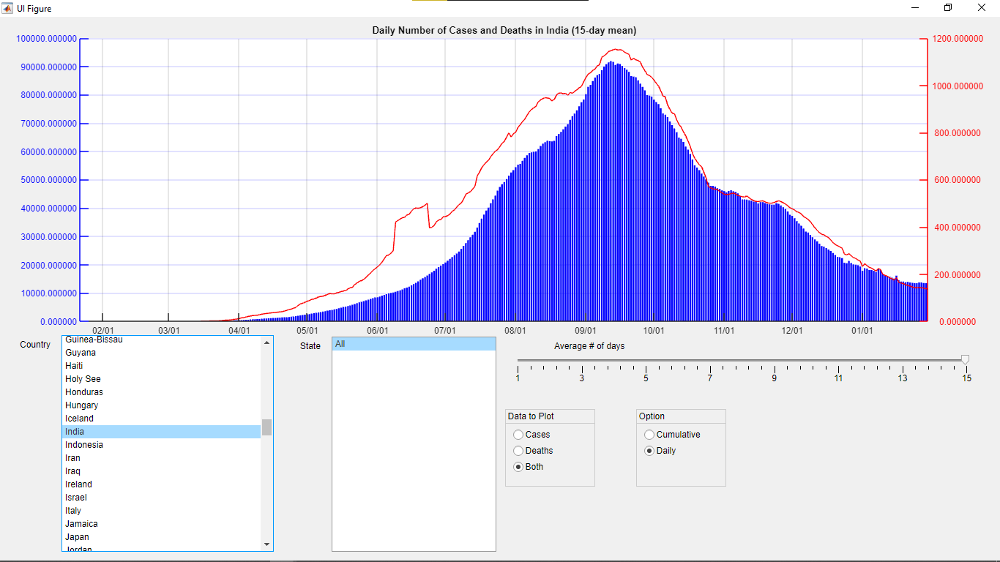

Goal: Create a MATLAB application to process and visualize COVID-19 data.
Data: Load global case/death data by country/state from JHU's Coronavirus Resource Center.
Processing: Convert data into objects for countries and states (hierarchical structure).
Visualization:

Plot data (cases/deaths, cumulative/daily).
Update plot title with selection info (country, options used).
GUI elements:
Plot area.
Country list box (incl. "Global").
State list box (incl. "All").
Moving average selection (1-15 days).
Plot type selection (cases, deaths, both).
Data type selection (cumulative, daily).

https://github.com/iampramodyadav/MATLAB/assets/72774410/8c949399-b2a0-41cc-8f8f-97a48a8e46fb

## Back end code
```MATLAB
	properties (Access = private)
			xData
			Cases_Deaths_Matrix
			CasesVec
			DeathsVec
			AveragesCases
			AveragesDeaths
			AvergingWindow
			Int_title
			tav   
	end

    methods (Access = private)
    
        function PlotData(app)
            app.UIAxes.reset;
            ta=int8('Cumulative Number of Cases in ');
            tb=int8('Cumulative Number of Deaths in ');
            tc=int8('Cumulative Number of Cases and Deaths in ');
            td=int8('Daily Number of Cases in ');
            te=int8('Daily Number of Deaths in ');
            tf=int8('Daily Number of Cases and Deaths in ');
            if app.CasesButton.Value && app.CumulativeButton.Value
                app.CumulativeVec;
                app.ComputeAverages;
                bar(app.UIAxes,app.xData,app.AveragesCases,'b');
                num_title=[ta app.Int_title app.tav];
                title(app.UIAxes, char(num_title),"HorizontalAlignment", "center");
            elseif app.CasesButton.Value && app.DailyButton.Value
                app.DailyVec;
                app.ComputeAverages;
                bar(app.UIAxes,app.xData,app.AveragesCases,'b');
                num_title=[td app.Int_title app.tav];
                title(app.UIAxes, char(num_title),"HorizontalAlignment", "center");
            elseif app.DeathsButton.Value && app.CumulativeButton.Value
                app.CumulativeVec;
                app.ComputeAverages;
                plot(app.UIAxes,app.xData,app.AveragesDeaths,'r');
                num_title=[tb app.Int_title app.tav];
                title(app.UIAxes, char(num_title),"HorizontalAlignment", "center");
            elseif app.DeathsButton.Value && app.DailyButton.Value
                app.DailyVec;
                app.ComputeAverages;
                plot(app.UIAxes,app.xData,app.AveragesDeaths,'r');
                num_title=[te app.Int_title app.tav];
                title(app.UIAxes, char(num_title),"HorizontalAlignment", "center");
            elseif app.BothButton.Value && app.CumulativeButton.Value
                app.CumulativeVec;
                app.ComputeAverages;
                yyaxis(app.UIAxes,'left');
                bar(app.UIAxes,app.xData,app.AveragesCases,'b');app.UIAxes.YColor=[0.00 0.00 1.00];
                app.UIAxes.YLimMode='Auto';app.UIAxes.YTickMode='auto';
                set(app.UIAxes,'YTickLabel', num2str(get(app.UIAxes,'YTick').','%f'));
                hold(app.UIAxes,'on');
                yyaxis(app.UIAxes,'right');
                plot(app.UIAxes,app.xData,app.AveragesDeaths,'r');app.UIAxes.YColor=[1.00,0.00,0.00];
                num_title=[tc app.Int_title app.tav];
                title(app.UIAxes, char(num_title),"HorizontalAlignment", "center");
            elseif app.BothButton.Value && app.DailyButton.Value
                app.DailyVec;
                app.ComputeAverages;
                yyaxis(app.UIAxes,'left');
                bar(app.UIAxes,app.xData,app.AveragesCases,'b');app.UIAxes.YColor=[0.00 0.00 1.00];
                app.UIAxes.YLimMode='Auto';app.UIAxes.YTickMode='auto';
                set(app.UIAxes,'YTickLabel', num2str(get(app.UIAxes,'YTick').','%f'));
                hold(app.UIAxes,'on');
                yyaxis(app.UIAxes,'right');
                plot(app.UIAxes,app.xData,app.AveragesDeaths,'r');app.UIAxes.YColor=[1.00,0.00,0.00];
                num_title=[tf app.Int_title app.tav];
                title(app.UIAxes, char(num_title),"HorizontalAlignment", "center");
            end 
            xlim(app.UIAxes,[app.xData(1),app.xData(end)]);xlim(app.UIAxes,'manual');
            app.UIAxes.YLimMode='auto'; app.UIAxes.YTickMode='auto';
            grid(app.UIAxes,'on');
            datetick(app.UIAxes,'x','mm/dd',"keeplimits");
            set(app.UIAxes,'YTickLabel', num2str(get(app.UIAxes,'YTick').','%f'));
            hold(app.UIAxes,'off');
        end
        function ComputeAverages(app)
            app.AveragesCases=movmean(app.CasesVec,app.AvergingWindow);
            app.AveragesDeaths=movmean(app.DeathsVec,app.AvergingWindow);       
        end
        function DailyVec(app)
            app.CumulativeVec;
            x=app.CasesVec-circshift(app.CasesVec,1);
            x(1)=app.CasesVec(1);
            k=logical(x<0);
            x(k)=0;
            app.CasesVec=x;
            y=app.DeathsVec-circshift(app.DeathsVec,1);
            y(1)=app.DeathsVec(1);
            g=logical(y<0);
            y(g)=0;
            app.DeathsVec=y;
        end       
        function CumulativeVec(app)
            Item_Selected=Data(app.CountryListBox.Value);
            [~,in2]=ismember(app.StateListBox.Value, app.StateListBox.Items);
            [~,in1]=ismember(app.CountryListBox.Value, app.CountryListBox.Items);
            if in1==1
                app.Cases_Deaths_Matrix=Item_Selected.global_Cases_And_Deaths;
                app.CasesVec=app.Cases_Deaths_Matrix(1,:);
                app.DeathsVec=app.Cases_Deaths_Matrix(2,:);  
            else
                app.CasesVec=Item_Selected.Cases_Vector(Item_Selected.State_Index(in2));
                app.DeathsVec=Item_Selected.Deaths_Vector(Item_Selected.State_Index(in2));         
            end
        end
    end

```

```MATLAB
            globalData=Data('Global');
            app.CountryListBox.Items=(unique(globalData.Country,'stable'));
            app.StateListBox.Items=(unique(globalData.State,'stable'));
            app.Cases_Deaths_Matrix=globalData.global_Cases_And_Deaths;
            app.CasesVec=app.Cases_Deaths_Matrix(1,:);
            app.DeathsVec=app.Cases_Deaths_Matrix(2,:);
            startDate=datenum(globalData.Date{1});
            endDate=datenum(globalData.Date{end});
            app.xData=linspace(startDate,endDate,length(globalData.Date));
            app.AvergingWindow=app.AverageofdaysSlider.Value;
            app.StateListBoxValueChanged;
```

```MATLAB
            Item_Selected=Data(app.CountryListBox.Value);
            app.StateListBox.Items=(unique(Item_Selected.State,'stable'));
            app.StateListBoxValueChanged;
```


```MATLAB
            [~, in2] = ismember(app.StateListBox.Value,app.StateListBox.Items);
            if in2==1
                app.Int_title=app.CountryListBox.Value;
            else
                app.Int_title=app.CountryListBox.Value;
            end
            app.PlotData;
```

```MATLAB
			app.PlotData;
```

```MATLAB
			app.PlotData;
```


```MATLAB
            app.AvergingWindow=event.Value;
            if app.AvergingWindow~=1
                tav1=int8(' (');tav2=int8('-day mean)');
                app.tav=[tav1,int8(char(string(round(app.AvergingWindow)))),tav2];
            else
                app.tav=int8('');
            end
            app.PlotData;
```


## Class definition script
```MATLAB
classdef Data
    properties
        covidData
        Date
        Country
        Country_Index
        State
        State_Index
    end 
    methods
        function obj=Data(in)
            load covid_data.mat covid_data
            obj.covidData=covid_data;
            obj.Country= covid_data(:,1);
            obj.Date=covid_data(1,3:end);
            obj.Country{1} = 'Global';
            [~,n]= ismember(obj.Country, in);
            [~,obj.Country_Index] = max(n);
            obj.State_Index=obj.Country_Index:(obj.Country_Index+sum(n)-1);
            obj.State=covid_data(obj.State_Index,2);
            obj.State{1} = 'All';
    end
    function obj = Cases_Vector(obj,inc)
        CasesV=zeros(1,length(obj.Date));
        for ii=3:length(obj.Date)+2
            CasesV(ii-2) = obj.covidData{inc,ii}(1 ,1);
        end
        obj = CasesV;
    end
    function obj = Deaths_Vector(obj,ind)
        DeathsV=zeros(1,length(obj.Date));
        for ii=3: length(obj.Date) +2
            DeathsV(ii-2)=obj.covidData{ind,ii}(1,2);
        end
        obj=DeathsV;
    end
    function obj = global_Cases_And_Deaths(obj)
        states=obj.covidData(:, 2);
        All=zeros(1,length(states));
        global_Cases = zeros(length(states), length(obj.Date));
        global_Deaths = zeros(length(states), length(obj.Date));
        for i= 1:length(states)
            if isempty(states{i})
                All(i) = i;
            end
        end
        for ii = 1:length(states)
            if All(ii) ==0
                continue;
            else
                for jj = 3:length(obj.Date)+2
                    global_Cases(ii,jj-2)= obj.covidData{ii,jj}(1,1);
                end
                for k=3:length(obj.Date)+2
                    global_Deaths(ii,k-2)=obj.covidData {ii,k}(1,2);
                end
            end
        end
        obj = [sum(global_Cases);sum(global_Deaths)];
        end
    end
end
```
